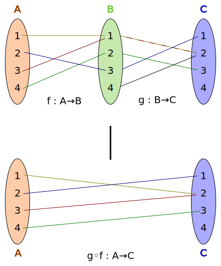
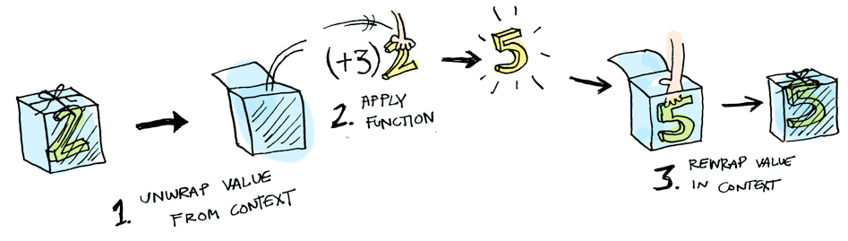

<style>

code {
  display: inline-block;
  font-family: "Monaco", monospace;
  font-size: 0.8em;
  letter-spacing: 0;
  margin: -0.1em 0.15em;
  padding: 0.1em 0.2em;
  vertical-align: baseline;
  color: yellow;
}

pre {
  display: block;
  border: 0px;
  border-radius: 5px;
  min-height: 1em;
  overflow: visible;
  background:linear-gradient(180deg, #282a36 0, #282a36);
}

pre code {
  box-sizing: border-box;
  margin: 0;
  min-width: 100%;
  font-size: 0.9em;
  color: #f8f8f2;
  line-height: 140%;
}

pre code svg[data-marp-fitting=svg] {
  max-height: calc(580px - 1em);
}

img[alt~="center"] {
  display: block;
  margin: 0 auto;
}
</style>

<!-- _class: lead invert -->
<style scoped>
h1 {
  font-size: 2.5em;
  color: #ffb86c;
  text-align: center;
}
h3 {
  text-align: center;
}
section {
  text-align: center;
}
</style> 

# FP and Rx

### 函数式编程和 Rx 简明介绍

https://github.com/nanomichael

---

## 一个例子

```Java
if (a != null) {
  b = getB(a);
  if (b != null) {
    c = getC(b);
    if (c != null) {
      d = getD(c);
      // ...
    }
  }
}
```

---

### Optional and `'?.'`

```Java
Optional
  .ofNullable(a)
  .flatMap(a -> Optional.ofNullable(getB(a)))
  .flatMap(b -> Optional.ofNullable(getC(b)))
  .flatMap(c -> Optional.ofNullable(getD(c)))
  // ...
  .ifPresent(x -> doSomething(x));
```

```Kotlin
a
  ?.let { getB(it) }
  ?.let { getC(it) }
  ?.let { getD(it) }
  // ...
  ?.run { doSomething(it) }
```

---

## 另一个例子

```Kotlin
val a = listOf(1, 2, 3)
val b = listOf(4, 5, 6)
val c = listOf(7, 8, 9)
// ...
val list = mutableListOf<List<Int>>()
for (ai in a) {
  for (bi in b) {
    for (ci in c) {
      // ...
      list += listOf(ai, bi, ci, ...)
    }
  }
}
```

---

### flatMap

```Kotlin
val list = a
  .flatMap { ai ->
    b.map { bi ->
      listOf(ai, bi)
    }
  }
  .flatMap { list ->
    c.map { ci ->
      list + ci
    }
  }
  // ...
```

将 `if` 和 `for` 后的代码块看作是回调函数，同步代码也会产生 `callback hell`。

---

## Function

> In mathematics, a function is a binary relation over two sets that associates every element of the first set, to exactly one element of the second set. 
>
> -- [_from wikipedia_](https://en.wikipedia.org/wiki/Function_(mathematics))

- 一个集合到另一个集合的映射，`y = f(x)`
- 定义域和值域限定函数的作用范围
- 给定一个输入，有且仅有一个输出
- 若定义域和值域匹配，函数间可组合，记作：`(f.g)(x) = f(g(x))`



---

## Functional programming

> In computer science, functional programming is a programming paradigm where programs are constructed by _**applying and composing functions**_. It is a _**declarative**_ programming paradigm in which function definitions are trees of expressions that each return a value, rather than a sequence of imperative statements which change the state of the program.
>
> -- [_from wikipedia_](https://en.wikipedia.org/wiki/Functional_programming)

- 函数是一等公民
- 应用程序通过函数组合而成
- 由表达式构成，而不是语句

---

## Function composition

> Functional programming is all about function composition, nothing more.


---

### 一个例子

给定一个文件，内容为一个网络地址：

- 读取文件内容
- 将文件内容作为参数，获取网络资源
- 保存内容到本地并返回文件地址

```Kotlin
fun readFile(path: String): String = // ...
fun readNet(url: String): String = // ...
fun saveIntoFile(content: String): String = // ...

val contentPath = saveIntoFile(readNet(readFile(filePath)))
```

---

### 另一种形式

```Haskell
(f . g) x = f(g(x))
```

```
infix fun <T, R1, R2> ((R1) -> R2).compose(g: (T) -> R1) = { t: T ->
  this(g(t))
}

val f = ::saveIntoFile compose ::readNet compose ::readFile
val contentPath = f(filePath)
```


---

### Chain style

```Kotlin
infix fun <T, R1, R2> ((T) -> R1).then(f: (R1) -> R2) = { t: T ->
  f(this(t))
}

val f = ::readFile then ::readNet then ::saveIntoFile
val contentPath = f(filePath)
```

---

### Async

```Kotlin
fun readFileCallback(path: String, callback: (url: String) -> Unit) {
  callback(readFile(String))
}
fun readNetCallback(url: String, callback: (content: String) -> Unit) {
  callback(readNet(String))
}
fun saveIntoFileCallback(content: String, callback: (path: String) -> Unit) {
  callback(saveIntoFile(content))
}

readFileCallback(path) { url ->
  readNetCallback(url) { content ->
    saveIntoFileCallback(content) { path -> /* do something */ }
  }
}
```

---

我们希望的是：

```Kotlin
val readFileF = ???
val readNetF = ???
val saveIntoFileF = ???

val f = readFileF then readNetF then saveIntoFileF
f { contentPath ->
  doSomething()
}
```

我们希望各个异步函数也能进行组合，而现在各个函数的定义域和值域都不匹配

---

## Currying and Higher Order Function

所谓「柯里化」，就是将一个有多个参数的函数转换为一个每次只接受一个参数的函数，这个函数被称为「高阶函数」。编程语言 `Haskell` 天然支持「柯里化」。

```Haskell
sum :: (Num a) -> a -> a -> a
sum x y = x + y

let sum3 = sum 3 -- 相当于 3 + ?
sum3 2 -- 相当于 3 + 2
```

---

Kotlin 实现：

```Kotlin
fun <T1, T2, R> ((T1, T2) -> R).currying() = { t1: T1 ->
  { t2: T2 -> this(t1, t2) }
}

val readFileF = ::readFileWithCallback.currying()(path) // ((T) -> Unit) -> Unit
readFileF { url ->
  println(url)
}
```

通过「柯里化」，现在各个函数的定义域和值域相匹配了

---

将「柯里化」后的函数抽象，定义一个「高阶函数」，消除实际参数，只保留 `callback` 参数：

```Kotlin
typealias Callback<T> = (T) -> Unit

typealias F<T> = (Callback<T>) -> Unit // ((T) -> Unit) -> Unit

fun <T> id(x: T): F<T> = { f -> f(x) } // identity
```

这种形式也被称为 [CPS (Continuation Passing Style)](https://en.wikipedia.org/wiki/Continuation-passing_style)，这个回调也叫 `continuation`，字面意思就是「延续」，在逻辑上和顺序调用的函数是等价的。问题来了，如何组合这些函数？

---

## Functor

首先考虑一种情况，如何组合普通函数？将 `F<T>` 看作一个盒子，盒子里包含了函数的调用过程，「组合」就是将这个盒子打开，取出值，然后应用这个函数，把这个函数的值再放到一个盒子里，`Functor` 定义了这个过程。



```Haskell
class Functor f where fmap :: (a -> b) -> f a -> f b
```

---

Kotlin 表示:

```Kotlin
infix fun <T, R> F<T>.fmap(f: (T) -> R): F<R> = { callback: Callback<R> ->
  this { t -> callback(f(t)) }
}
```

现在可以以 `callback` 的方式对普通函数进行链式调用了

```Kotlin
val f = id(filePath)
  .fmap { path -> readFile(path) }
  .fmap { url -> readNet(url) }
  .fmap { content -> saveIntoFile(content) }
f { println(it) }
// 或者
val g = id(filePath) fmap ::readFile fmap ::readNet fmap ::saveIntoFile
```

WOW！ `callback hell` 没了！

---

## Monad

还有一个问题，`F<*>` 之间怎么组合？`Functor` 可以将 `callback` 和普通函数组合，而更普遍的情况是，只提供了 `callback` 形式的函数。`Monad` 可以解决这个问题。

> The curse of the monad is that once you get the epiphany, once you understand ‘oh that’s what it is’, you lose the ability to explain it to anybody else.
>
> -- [_Douglas Crockford_](https://en.wikipedia.org/wiki/Douglas_Crockford)

- 一种数据类型
- 用来表示「计算」而不是「数据」
- 用来组织包含有序操作的过程，或者定义任意的控制流（比如处理并发、异常、延续等等）
- 这个例子中，就是要处理「延续」

---

Kotlin 实现（一般这个函数叫做 `bind`）：

```Kotlin
infix fun <T, R> F<T>.bind(f: (T) -> F<R>): F<R> = { callback: Callback<R> ->
  this { t -> f(t)(callback) }
}
```

组合一下：

```Kotlin
val g = id(filePath)
    .bind(::readFileCallback.currying())
    .bind(::readNetCallback.currying())
    .bind(::saveIntoFileCallback.currying())
g { println(it) }
```

`callback hell` 被完美消除

---

## Conclusion

- 函数式编程的核心是函数组合
- `Functor` 解决 `F<T>` 与普通函数的组合问题
- `Monad` 解决 `F<T>` 之间的组合问题
- 这两种方法解决了 `callback hell`
- 通过 `Functor` 和 `Monad` 可以定义任意的操作符号

所有代码可在[这里](https://gist.github.com/NanoMichael/1639a06805d93319c673b991e13c6047)找到

---

## References

- [_Why Do Monads Matter?_](https://cdsmith.wordpress.com/2012/04/18/why-do-monads-matter/)

- [_Functors, Applicatives, And Monads In Pictures_](http://adit.io/posts/2013-04-17-functors,_applicatives,_and_monads_in_pictures.html)

- [_Monads_](http://softwaresimply.blogspot.com/2012/04/ltmt-part-2-monads.html)

- [_Category Theory for Programmers_](https://unglueit-files.s3.amazonaws.com/ebf/e90890f0a6ea420c9825657d6f3a851d.pdf)

---

## What next ...

- Applicative
- Error handling
- Control driven and Data driven
- Proactive and Reactive
- Purity
